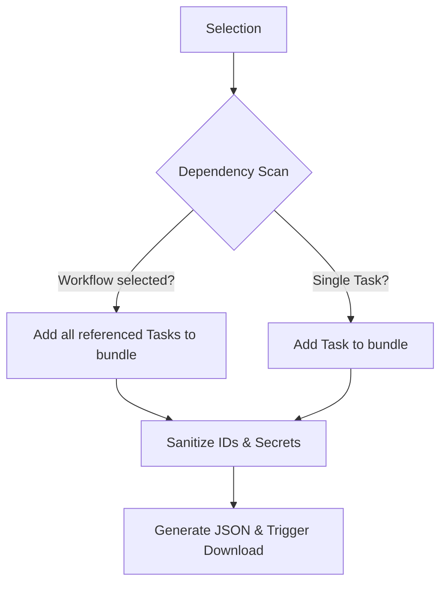

# Design: Export & Import System

Status: **Draft** | Priority: **High** | Version: **1.0**

## 1. Overview
This feature enables users to export one or more Tasks or Workflows into a portable format (`.restmon.json`) and import them into other environments or share them with other users.

### Core Objectives
- **Portability**: Move automations between Dev, Sandbox, and Prod environments.
- **Collaboration**: Share common task templates or workflow patterns.
- **Safety**: Ensure sensitive data (secrets) are never leaked during export.
- **Integrity**: Workflows must be exported with their dependent tasks to remain functional.

---

## 2. Technical Specification

### 2.1 The "RestMon Bundle" Format
The export file is a versioned JSON object that can contain tasks, workflows, and folders.

```json
{
  "$schema": "https://restmon.io/schemas/export-v1.json",
  "metadata": {
    "version": "1.0",
    "exportedAt": "2024-04-13T12:00:00Z",
    "source": "RestMon-Instance-A",
    "itemCount": 5
  },
  "data": {
    "folders": [],
    "tasks": [
      {
        "name": "Login API",
        "command": { "url": "https://api.example.com/login", "method": "POST" },
        "sanitized": true
      }
    ],
    "workflows": [
      {
        "name": "Auth Flow",
        "nodes": [...],
        "edges": [...]
      }
    ]
  }
}
```

### 2.2 Security & Sanitization
> [!WARNING]
> Security is paramount. Exported files must never contain actual secret values.

1.  **Secrets**: Any reference to a `secretId` in a Task should be preserved, but the system must ensure the actual value is NOT included. 
2.  **Placeholders**: On import, if a task references a secret name that doesn't exist in the target system, the user should be prompted to select/create a local secret.
3.  **Owner Metadata**: All `ownerId` and `id` (primary keys) fields are stripped or flagged for regeneration on import.

---

## 3. Functional Design

### 3.1 Export Workflow


### 3.2 Import & Conflict Resolution
When a file is uploaded, the system performs a "Pre-flight Check".

| Scenario | System Action | User Option |
| :--- | :--- | :--- |
| **New Entity** | Mark as `Ready` | None |
| **Name Collision** | Detect existing item with same name | `Overwrite` / `Create Copy` / `Skip` |
| **Missing Secret** | Detect reference to unknown Secret | `Map to Existing` / `Create Placeholder` |
| **Circular Dep** | Prevent import and show error | Fix file manually |

---

## 4. UX / UI Design

### 4.1 Selection Mode (Tasks & Workflows)
- **Checkboxes**: Visible on hover for each list item.
- **Floating Action Bar**: A sleek, bottom-aligned bar appearing when > 0 items are selected.
  - Actions: `Export`, `Delete Selected`, `Move to Folder`.
  - Display: "3 items selected".

### 4.2 Import UI (The "Wizard")
A modal-based multi-step process:
1.  **Upload**: Drag & drop zone.
2.  **Review**: List of items found in the file with status badges (New, Conflict, Warning).
3.  **Mapping**: Interface to map missing secrets or select conflict resolutions.
4.  **Confirm**: Final "Import All" button with progress bar.

---

## 6. Environment Promotion (Dev -> Prod)
The system is designed to facilitate "Promoting" automations from a development instance to a production instance.

### 6.1 Promotion Strategy
- **Parametrization**: Users should be encouraged to use **Global Variables** for environment-specific strings (e.g., `{{BASE_URL}}`). The exporter preserves the variable reference, while the local environment provides the value.
- **Secret Re-binding**: On import to Prod, the system will highlight missing secrets. The user can "Re-bind" a dev-secret reference to an existing production-secret.
- **Version Incrementing**: If an imported item matches an existing one by name, the system will offer to **"Create New Version"**, which updates the definition while incrementing the version number, preserving history in the target environment.

---

## 9. Implementation Tasks

> [!NOTE]
> This feature assumes **Workflow Folder Management** has already been implemented or is treated as a separate infrastructure layer.

### Phase 1: Core Logic (Backend)
- [ ] **Recursive Collector**: Utility to scan a workflow and gather all its dependent tasks (including nested Child Workflows).
- [ ] **Sanitizer**: Logic to strip IDs, owner info, and ensure secrets are only referenced by name.
- [ ] **Export Endpoint**: `POST /api/export` receiving a list of entity IDs and returning the JSON.
- [ ] **Import Validator & Dry-Runner**: Schema validation and "pre-flight" check logic.

### Phase 2: Selection UI (Frontend - Tasks)
- [ ] **Checkbox Component**: Add selection state to `Tasks.tsx` and `TaskCard`.
- [ ] **Bulk Action Bar**: Design and implement the floating bar with an "Export" trigger.
- [ ] **Folder Export**: Add export icon to folder headers.

### Phase 3: Selection UI (Frontend - Workflows)
- [ ] **Checkboxes in Dashboard**: Update `Dashboard.tsx` to support multi-select.
- [ ] **Row Export Action**: Individual export button in each workflow row.

### Phase 4: Import System (Frontend)
- [ ] **Import Modal**: Basic file upload component.
- [ ] **Preview List**: Component to display items from the JSON before they are saved.
- [ ] **Diff Viewer**: Side-by-side comparison for conflict resolution.
- [ ] **Secret Mapper**: UI for re-binding unknown secrets to existing local ones.
- [ ] **Finalizing Import**: Loop through validated items and hit creation endpoints.

### Phase 5: Polish & Safety
- [ ] **Sanity Checker**: Implement warnings for localhost URLs.
- [ ] **Auto-Tagging**: Implement logic to apply origin tags on import.
- [ ] Toast notifications and progress bars for large bundles.

### Phase 2: Selection UI (Frontend - Tasks)
- [ ] **Checkbox Component**: Add selection state to `Tasks.tsx` and `TaskCard`.
- [ ] **Bulk Action Bar**: Design and implement the floating bar with an "Export" trigger.
- [ ] **Folder Export**: Add export icon to folder headers.

### Phase 3: Selection UI (Frontend - Workflows)
- [ ] **Checkboxes in Dashboard**: Update `Dashboard.tsx` to support multi-select.
- [ ] **Row Export Action**: Individual export button in each workflow row.

### Phase 4: Import System (Frontend)
- [ ] **Import Modal**: Basic file upload component.
- [ ] **Preview List**: Component to display items from the JSON before they are saved.
- [ ] **Diff Viewer**: Side-by-side comparison for conflict resolution.
- [ ] **Secret Mapper**: UI for re-binding unknown secrets to existing local ones.
- [ ] **Finalizing Import**: Loop through validated items and hit creation endpoints.

### Phase 5: Polish & Safety
- [ ] **Sanity Checker**: Implement warnings for localhost URLs.
- [ ] **Auto-Tagging**: Implement logic to apply origin tags on import.
- [ ] Toast notifications and progress bars for large bundles.
