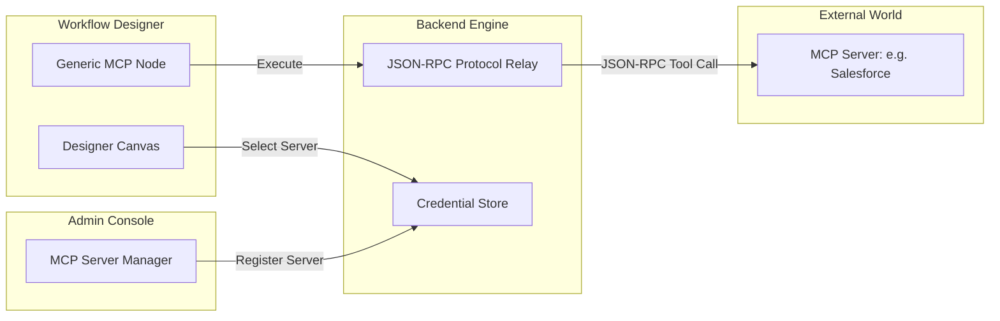

# Use Case Design: MCP Client Node (Integration Bus)

This document details the refined design for an autonomous **MCP Client Node** within the NovaTayan platform, following a Centralized Management strategy.

## 1. Concept
The **MCP Client Node** is a "Universal Connector." Instead of hardcoding logic for every external tool, the platform connects to **MCP Servers** centrally. The node then dynamically "shapes" its UI based on the capabilities advertised by the connected server.

## 2. Platform Roadmap (The 5-Phase Evolution)

| Phase | Title | Focus | Key Deliverables |
| :--- | :--- | :--- | :--- |
| **Phase 1** | **Connectivity** | Central Registry & Relay | Central Admin UI for Server Registration; Backend Protocol Relay; Node with Server Selection & Tool Dropdown. |
| **Phase 2** | **Intelligence** | AI-First Payload Engine | Replaces legacy "dynamic forms" concept with an Agentic Copilot that auto-generates deeply nested JSON payload structures based on natural language intent. |
| **Phase 3** | **Validation** | Sandbox Testing | Real-time tool execution button; live preview to test variables and MCP validation before workflow runtime. |
| **Phase 4** | **Ecosystem** | Integrated Library | MCP servers automatically register tools as native-looking Tasks in the Designer Library; NovaTayan-as-a-Server mode. |
| **Phase 5** | **Enterprise** | Elite Orchestration | Secure local-to-cloud tunneling; Health/Latency monitoring dashboard; High-availability relay. |

## 3. Architectural Overview

## 4. UI/UX Flow (Phase 1 Focused)

1.  **Central Registration (Administration):**
    *   Admin navigates to Settings -> MCP Integration Hub.
    *   Admin registers a server (e.g., "Company Knowledge Base") with its URL and access keys.
    *   Server is validated and stored globally.

2.  **Node Configuration (Designer):**
    *   User drags an "MCP Node" onto the canvas.
    *   **Server Selection:** User picks "Company Knowledge Base" from a dropdown (No URLs needed).
    *   **Tool Selection:** Dropdown is automatically populated via the MCP `list_tools` command.
    *   **Parameters:** Uses an advanced `VariableAwareInput` JSON block strictly paired with the AI Copilot to handle complex schema mapping automatically.

3.  **Runtime Execution:**
    *   Workflow engine resolves variables -> relay sends `call_tool` -> result is injected into context for downstream nodes.

## 5. Technical Requirements

1.  **Backend:** Implement `MCPClientManager` using `@modelcontextprotocol/sdk`.
2.  **Database:** Update `Settings` or create `MCPServer` entity to store registered connections.
3.  **Frontend:** 
    *   Update `AdminSettings.tsx` with an `MCPServerManager` component.
    *   Modify `TaskEditShelf.tsx` to support the dynamic server/tool selection logic.
